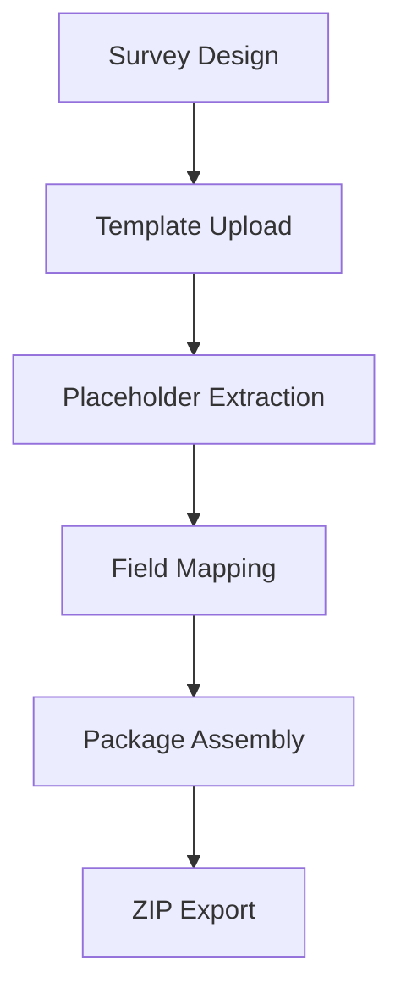
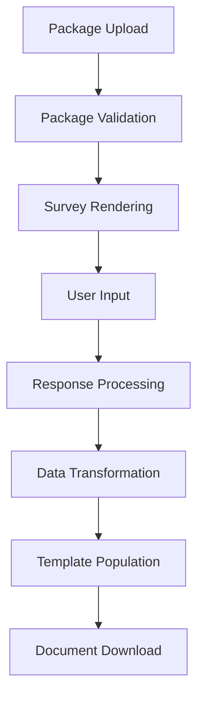

# Document Assembly MVP - Technical Documentation

## 🏗️ Architecture Overview

The Document Assembly MVP is a client-side web application built with modern web technologies. It follows a modular service-oriented architecture for maintainability and extensibility.

### Core Technologies

- **Frontend**: TypeScript, Vite, Tailwind CSS
- **Document Processing**: docxtemplater, PizZip
- **Survey Engine**: Survey.js (Creator & Core)
- **File Handling**: FileSaver.js, HTML5 File API
- **Build System**: Vite with TypeScript compilation

### Application Structure

```
src/
├── main.ts                    # Entry point for user interface
├── creator-main.ts            # Entry point for creator interface
├── style.css                  # Global styles
├── services/                  # Core business logic
│   ├── surveyCreator.ts       # Survey.js Creator integration
│   ├── surveyRuntime.ts       # Survey.js runtime for users
│   ├── docxParser.ts          # DOCX template parsing
│   ├── fieldMapping.ts        # Field mapping management
│   ├── packageService.ts      # Package creation/import
│   └── documentGenerator.ts   # Document generation pipeline
├── utils/                     # Shared utilities
│   └── common.ts              # DOM utilities and helpers
└── types/                     # TypeScript definitions
    └── index.ts               # Shared type definitions
```

## 📦 Service Architecture

### SurveyCreatorService
**Purpose**: Integrates Survey.js Creator for survey design interface

**Key Methods**:
- `initialize()` - Sets up creator interface
- `getSurveyJson()` - Exports survey definition
- `loadSurvey()` - Imports existing survey
- `setupEventHandlers()` - Configures UI interactions

**Dependencies**: Survey.js Creator library

### SurveyRuntimeService  
**Purpose**: Renders surveys for end users and collects responses

**Key Methods**:
- `initialize()` - Renders survey from definition
- `handleFormSubmit()` - Processes completed survey
- `saveDraft()` - Saves partial responses
- `validateResponses()` - Ensures data completeness

**Dependencies**: Survey.js Core library, DOM manipulation utilities

### DocxParserService
**Purpose**: Parses DOCX templates to extract placeholders

**Key Methods**:
- `parseDocx()` - Main parsing method
- `extractPlaceholders()` - Finds template variables
- `validateTemplate()` - Checks template integrity
- `analyzeComplexity()` - Assesses template features

**Dependencies**: PizZip for ZIP manipulation

**Placeholder Detection**:
```typescript
// Simple placeholders: {field_name}
private static readonly SIMPLE_REGEX = /\{([^}]+)\}/g;

// Conditional placeholders: {{#if condition}}...{{/if}}  
private static readonly CONDITIONAL_REGEX = /\{\{#if\s+([^}]+)\}\}(.*?)\{\{\/if\}\}/gs;

// Loop placeholders: {{#each items}}...{{/each}}
private static readonly LOOP_REGEX = /\{\{#([^}]+)\}\}(.*?)\{\{\/\1\}\}/gs;
```

### FieldMappingService
**Purpose**: Manages connections between survey fields and template placeholders

**Key Methods**:
- `createMapping()` - Creates field-to-placeholder connection
- `generateSuggestions()` - Auto-suggests mappings based on names
- `validateMappings()` - Ensures mapping completeness
- `exportMappings()` - Serializes mapping configuration

**Mapping Algorithm**:
```typescript
// Similarity scoring for auto-suggestions
private static calculateSimilarity(surveyField: string, placeholder: string): number {
  const field = surveyField.toLowerCase().replace(/[^a-z0-9]/g, '');
  const placeholder = placeholder.toLowerCase().replace(/[^a-z0-9]/g, '');
  
  // Levenshtein distance with normalization
  const distance = this.levenshteinDistance(field, placeholder);
  const maxLength = Math.max(field.length, placeholder.length);
  return maxLength === 0 ? 1 : (maxLength - distance) / maxLength;
}
```

### PackageService
**Purpose**: Creates, validates, and imports document packages

**Key Methods**:
- `createPackage()` - Bundles content into package
- `exportPackage()` - Generates downloadable ZIP
- `importPackage()` - Processes uploaded packages
- `validatePackage()` - Ensures package integrity

**Package Structure**:
```typescript
interface PackageContent {
  metadata: PackageMetadata;
  survey: SurveyDefinition;
  template?: {
    filename: string;
    content: ArrayBuffer;
    placeholders: DocxPlaceholder[];
  };
  mappings: FieldMapping[];
  readme?: string;
}
```

### DocumentGeneratorService
**Purpose**: Generates final DOCX documents from survey responses

**Key Methods**:
- `generateDocument()` - Main generation pipeline
- `transformResponsesToTemplateData()` - Maps survey data to template variables
- `processTemplate()` - Uses docxtemplater to populate template
- `saveDocument()` - Handles file download

**Data Transformation Pipeline**:
```typescript
// Example transformations
transformValue(value: any): any {
  if (Array.isArray(value)) {
    return value.join(', '); // ["A", "B", "C"] → "A, B, C"
  }
  if (typeof value === 'boolean') {
    return value ? 'Yes' : 'No'; // true → "Yes"
  }
  if (typeof value === 'number' && value > 1000) {
    return new Intl.NumberFormat('en-US', {
      style: 'currency',
      currency: 'USD'
    }).format(value); // 50000 → "$50,000.00"
  }
  return String(value);
}
```

## 🔄 Data Flow

### Package Creation Workflow



1. **Survey Design**: User creates survey using Survey.js Creator
2. **Template Upload**: DOCX file uploaded and validated
3. **Placeholder Extraction**: DocxParser analyzes template
4. **Field Mapping**: FieldMappingService connects survey to placeholders
5. **Package Assembly**: PackageService bundles all components
6. **ZIP Export**: Final package downloaded as ZIP file

### Document Generation Workflow



1. **Package Upload**: User uploads ZIP package
2. **Package Validation**: Structure and content verification
3. **Survey Rendering**: Dynamic form generation from package
4. **User Input**: Survey completion by end user
5. **Response Processing**: Data validation and cleaning
6. **Data Transformation**: Format conversion for template compatibility
7. **Template Population**: docxtemplater processes template
8. **Document Download**: Generated DOCX automatically downloaded

## 🔌 API Reference

### PackageService Static Methods

```typescript
class PackageService {
  static async createPackage(
    survey: SurveyDefinition,
    template: File,
    mappings: FieldMapping[],
    metadata: PackageMetadata
  ): Promise<PackageContent>

  static async exportPackage(
    packageContent: PackageContent,
    filename?: string
  ): Promise<void>

  static async importPackage(
    file: File
  ): Promise<PackageContent>

  static validatePackage(
    packageContent: PackageContent
  ): PackageValidation
}
```

### DocumentGeneratorService Static Methods

```typescript
class DocumentGeneratorService {
  static async generateDocument(
    surveyResponses: Record<string, any>,
    packageContent: PackageContent,
    templateFilename?: string
  ): Promise<void>

  static validateTemplateData(
    surveyResponses: Record<string, any>,
    fieldMappings: FieldMapping[]
  ): ValidationResult

  static getTemplateDataPreview(
    surveyResponses: Record<string, any>,
    fieldMappings: FieldMapping[]
  ): Record<string, any>
}
```

### FieldMappingService Methods

```typescript
class FieldMappingService {
  createMapping(
    surveyField: string,
    placeholder: DocxPlaceholder,
    isRequired: boolean = false
  ): FieldMapping

  generateSuggestions(
    surveyFields: string[],
    placeholders: DocxPlaceholder[]
  ): MappingSuggestion[]

  validateMappings(
    mappings: FieldMapping[],
    placeholders: DocxPlaceholder[]
  ): MappingValidation

  exportMappings(): FieldMapping[]
  importMappings(mappings: FieldMapping[]): void
}
```

## 🎨 UI Component Architecture

### Creator Interface Components

#### Tab Navigation System
```typescript
interface TabConfig {
  id: string;
  title: string;
  icon: string;
  component: () => HTMLElement;
  validator?: () => boolean;
}

const tabs: TabConfig[] = [
  {
    id: 'survey-designer',
    title: 'Survey Designer', 
    icon: '📋',
    component: () => this.renderSurveyDesigner(),
    validator: () => this.validateSurvey()
  },
  // ... other tabs
];
```

#### Drag-and-Drop Implementation
```typescript
// Field mapping drag-and-drop
setupDragAndDrop() {
  // Survey fields (draggable)
  surveyFields.forEach(field => {
    field.draggable = true;
    field.addEventListener('dragstart', (e) => {
      e.dataTransfer?.setData('text/plain', field.dataset.fieldName);
    });
  });

  // Placeholder targets (droppable)
  placeholders.forEach(placeholder => {
    placeholder.addEventListener('dragover', (e) => e.preventDefault());
    placeholder.addEventListener('drop', (e) => {
      const fieldName = e.dataTransfer?.getData('text/plain');
      this.createMapping(fieldName, placeholder);
    });
  });
}
```

### User Interface Components  

#### Package Upload Component
```typescript
class PackageUploader {
  private setupEventListeners(): void {
    // File input change
    this.fileInput.addEventListener('change', (e) => {
      const file = e.target.files?.[0];
      if (file) this.handleFileUpload(file);
    });

    // Drag and drop
    this.dropZone.addEventListener('drop', (e) => {
      e.preventDefault();
      const files = e.dataTransfer?.files;
      if (files?.[0]) this.handleFileUpload(files[0]);
    });
  }

  private async handleFileUpload(file: File): Promise<void> {
    try {
      this.showLoading();
      const packageContent = await PackageService.importPackage(file);
      this.onPackageLoaded(packageContent);
    } catch (error) {
      this.showError(error.message);
    }
  }
}
```

## 🔧 Configuration & Setup

### Development Environment

#### Prerequisites
```bash
# Node.js 18+ required
node --version  # Should be 18.0.0 or higher
npm --version   # Should be 8.0.0 or higher
```

#### Installation
```bash
# Clone repository
git clone <repository-url>
cd unlawful-assembly

# Install dependencies  
npm install

# Start development server
npm run dev

# Build for production
npm run build
```

#### Development Scripts
```json
{
  "scripts": {
    "dev": "vite",
    "build": "tsc && vite build", 
    "preview": "vite preview",
    "type-check": "tsc --noEmit"
  }
}
```

### Build Configuration

#### Vite Configuration
```typescript
// vite.config.ts
export default defineConfig({
  plugins: [
    // TypeScript support
    typescript(),
  ],
  resolve: {
    alias: {
      '@': path.resolve(__dirname, './src')
    }
  },
  build: {
    rollupOptions: {
      input: {
        main: resolve(__dirname, 'index.html'),
        creator: resolve(__dirname, 'creator.html')
      }
    }
  }
});
```

#### TypeScript Configuration  
```json
{
  "compilerOptions": {
    "target": "ES2020",
    "module": "ESNext", 
    "moduleResolution": "node",
    "strict": true,
    "esModuleInterop": true,
    "skipLibCheck": true,
    "forceConsistentCasingInFileNames": true,
    "baseUrl": ".",
    "paths": {
      "@/*": ["src/*"]
    }
  },
  "include": ["src/**/*"],
  "exclude": ["node_modules", "dist"]
}
```

### Deployment Configuration

#### Static Hosting Setup
The application is fully client-side and can be deployed to any static hosting service:

- **Netlify**: Drag-and-drop `dist` folder
- **Vercel**: Connect GitHub repository  
- **GitHub Pages**: Use `gh-pages` branch
- **AWS S3**: Upload `dist` contents to S3 bucket

#### Production Build
```bash
# Create production build
npm run build

# Generated files in dist/
dist/
├── index.html          # User interface
├── creator.html        # Creator interface  
├── assets/
│   ├── main-[hash].js  # User interface bundle
│   ├── creator-[hash].js # Creator interface bundle
│   └── style-[hash].css  # Compiled styles
└── template-generator.html # Template utility
```

## 🧪 Testing Framework

### Unit Testing Setup

#### Test Structure
```
tests/
├── services/           # Service layer tests
│   ├── packageService.test.ts
│   ├── docxParser.test.ts
│   └── fieldMapping.test.ts
├── utils/              # Utility function tests
│   └── common.test.ts
└── integration/        # End-to-end tests
    ├── packageFlow.test.ts
    └── documentGeneration.test.ts
```

#### Example Test Cases

```typescript
// packageService.test.ts
describe('PackageService', () => {
  describe('createPackage', () => {
    it('should create valid package with all components', async () => {
      const survey = createMockSurvey();
      const template = createMockTemplate();
      const mappings = createMockMappings();
      const metadata = createMockMetadata();

      const result = await PackageService.createPackage(
        survey, template, mappings, metadata
      );

      expect(result).toBeDefined();
      expect(result.metadata.title).toBe(metadata.title);
      expect(result.mappings.length).toBe(mappings.length);
    });
  });

  describe('validatePackage', () => {
    it('should identify missing required components', () => {
      const invalidPackage = createIncompletePackage();
      
      const validation = PackageService.validatePackage(invalidPackage);
      
      expect(validation.isValid).toBe(false);
      expect(validation.errors).toContain('Template is required');
    });
  });
});
```

### Integration Testing

```typescript
// documentGeneration.test.ts  
describe('Document Generation Flow', () => {
  it('should complete end-to-end generation', async () => {
    // 1. Create package
    const packageContent = await createTestPackage();
    
    // 2. Simulate survey responses
    const responses = {
      employee_name: 'John Doe',
      salary: 75000,
      position_title: 'Software Developer'
    };

    // 3. Generate document
    const result = await DocumentGeneratorService.generateDocument(
      responses, packageContent
    );

    // 4. Verify output
    expect(result).toBeDefined();
    // Additional assertions for document content
  });
});
```

## 📊 Performance Considerations

### File Processing Optimization

#### Large File Handling
```typescript
// Chunked file processing for large DOCX files
async function processLargeFile(file: File): Promise<DocxParseResult> {
  const chunkSize = 1024 * 1024; // 1MB chunks
  const chunks: ArrayBuffer[] = [];
  
  for (let offset = 0; offset < file.size; offset += chunkSize) {
    const chunk = file.slice(offset, offset + chunkSize);
    const buffer = await chunk.arrayBuffer();
    chunks.push(buffer);
  }
  
  // Process combined buffer
  const combined = new Uint8Array(chunks.reduce((acc, chunk) => acc + chunk.byteLength, 0));
  let position = 0;
  
  for (const chunk of chunks) {
    combined.set(new Uint8Array(chunk), position);
    position += chunk.byteLength;
  }
  
  return parseDocxBuffer(combined.buffer);
}
```

#### Memory Management
```typescript
// Cleanup after document generation
class DocumentGenerator {
  private cleanup(): void {
    // Clear large objects from memory
    this.templateBuffer = null;
    this.processedContent = null;
    
    // Force garbage collection (if available)
    if (window.gc) {
      window.gc();
    }
  }
}
```

### Browser Performance

#### Lazy Loading
```typescript
// Dynamic imports for better initial load time
async function loadDocumentGenerator() {
  const { DocumentGeneratorService } = await import('@/services/documentGenerator');
  return DocumentGeneratorService;
}

async function loadSurveyCreator() {
  const { SurveyCreatorService } = await import('@/services/surveyCreator');
  return SurveyCreatorService;
}
```

#### Debounced Operations
```typescript
// Debounced validation for better UX
const debouncedValidation = debounce((mappings: FieldMapping[]) => {
  const result = FieldMappingService.validateMappings(mappings);
  updateValidationUI(result);
}, 300);
```

## 🔒 Security Considerations

### File Upload Security

#### File Type Validation
```typescript
const ALLOWED_EXTENSIONS = ['.docx', '.zip'];
const MAX_FILE_SIZE = 50 * 1024 * 1024; // 50MB

function validateFileUpload(file: File): boolean {
  // Check file extension
  const extension = file.name.toLowerCase().split('.').pop();
  if (!ALLOWED_EXTENSIONS.includes(`.${extension}`)) {
    throw new Error(`Invalid file type: ${extension}`);
  }
  
  // Check file size
  if (file.size > MAX_FILE_SIZE) {
    throw new Error(`File too large: ${file.size} bytes`);
  }
  
  return true;
}
```

#### Content Sanitization  
```typescript
// Sanitize user input for template processing
function sanitizeTemplateData(data: Record<string, any>): Record<string, any> {
  const sanitized: Record<string, any> = {};
  
  for (const [key, value] of Object.entries(data)) {
    // Remove potentially dangerous content
    if (typeof value === 'string') {
      sanitized[key] = value
        .replace(/<script[^>]*>.*?<\/script>/gi, '') // Remove scripts
        .replace(/javascript:/gi, '') // Remove javascript: URLs
        .replace(/on\w+\s*=/gi, ''); // Remove event handlers
    } else {
      sanitized[key] = value;
    }
  }
  
  return sanitized;
}
```

### Client-Side Storage

#### Secure Local Storage
```typescript
// Encrypt sensitive data before local storage
class SecureStorage {
  private static encrypt(data: string): string {
    // Simple XOR encryption (use proper encryption for production)
    const key = 'document-assembly-key';
    let encrypted = '';
    
    for (let i = 0; i < data.length; i++) {
      encrypted += String.fromCharCode(
        data.charCodeAt(i) ^ key.charCodeAt(i % key.length)
      );
    }
    
    return btoa(encrypted);
  }

  static setItem(key: string, value: any): void {
    const encrypted = this.encrypt(JSON.stringify(value));
    localStorage.setItem(key, encrypted);
  }
}
```

## 📈 Monitoring & Analytics

### Error Tracking
```typescript
// Centralized error handling
class ErrorTracker {
  static trackError(error: Error, context?: any): void {
    const errorInfo = {
      message: error.message,
      stack: error.stack,
      timestamp: new Date().toISOString(),
      userAgent: navigator.userAgent,
      url: window.location.href,
      context
    };

    // Log to console in development
    if (process.env.NODE_ENV === 'development') {
      console.error('Error tracked:', errorInfo);
    }
    
    // Send to monitoring service in production
    if (process.env.NODE_ENV === 'production') {
      // this.sendToMonitoringService(errorInfo);
    }
  }
}
```

### Usage Analytics
```typescript
// Track user interactions for improvement insights
class UsageAnalytics {
  static trackEvent(eventName: string, properties?: any): void {
    const event = {
      name: eventName,
      properties,
      timestamp: new Date().toISOString(),
      sessionId: this.getSessionId()
    };

    // Store locally or send to analytics service
    console.log('Analytics event:', event);
  }

  // Example usage
  static trackPackageCreated(packageType: string): void {
    this.trackEvent('package_created', { packageType });
  }

  static trackDocumentGenerated(packageId: string): void {
    this.trackEvent('document_generated', { packageId });
  }
}
```

---

*This technical documentation covers the Phase 2 MVP implementation architecture, APIs, and deployment considerations. For user-facing instructions, see the User Guide.*